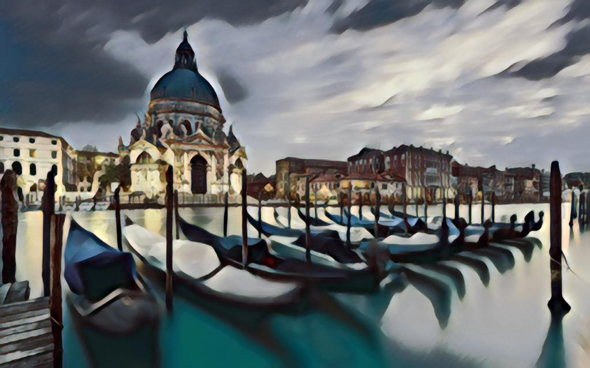
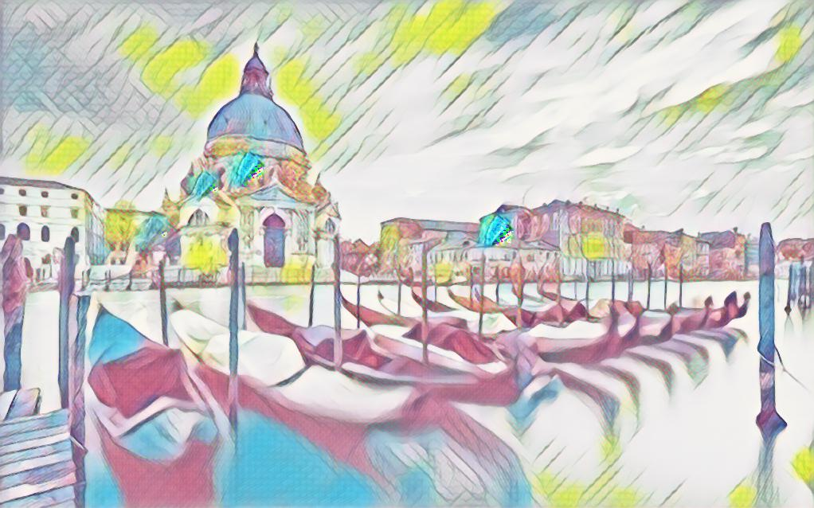
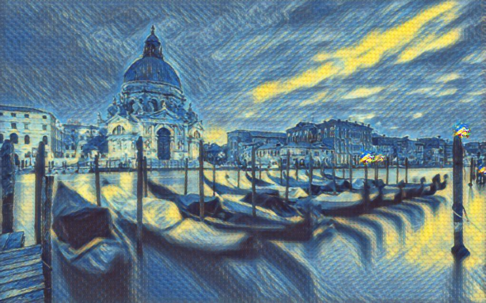
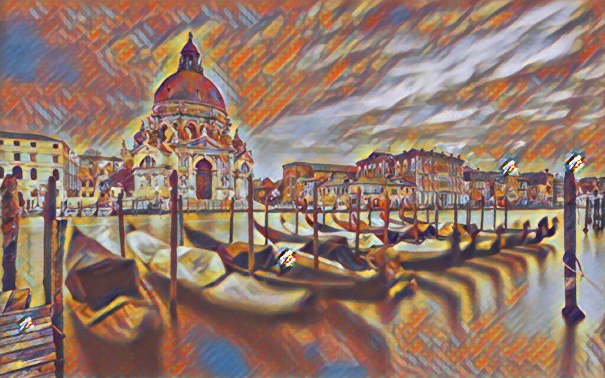
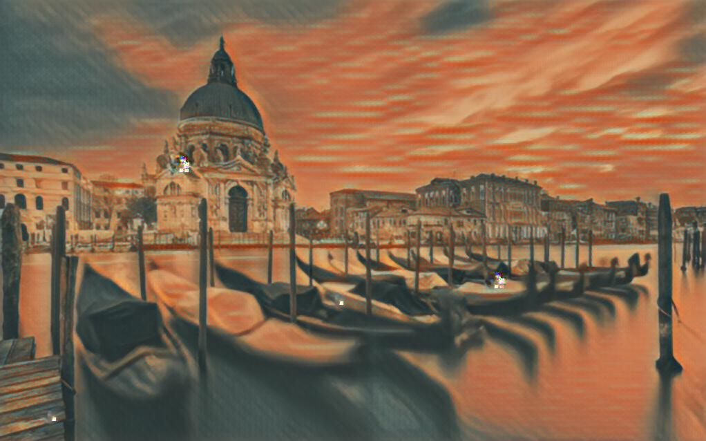
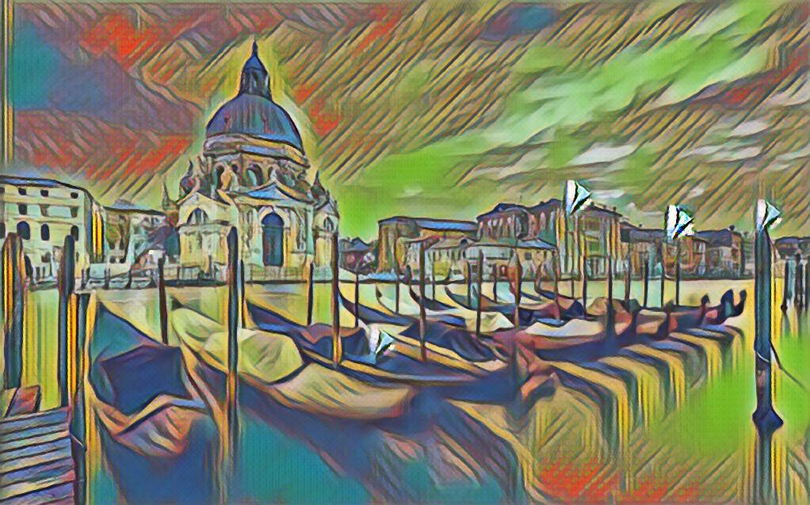
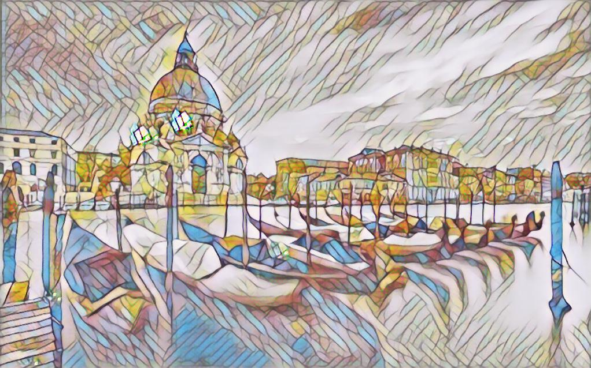
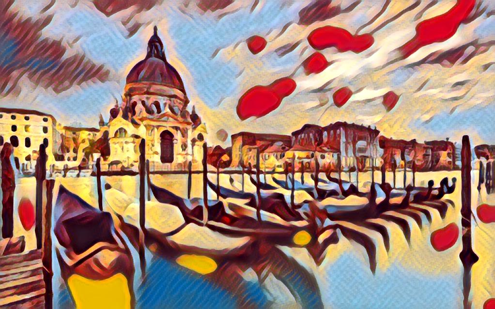
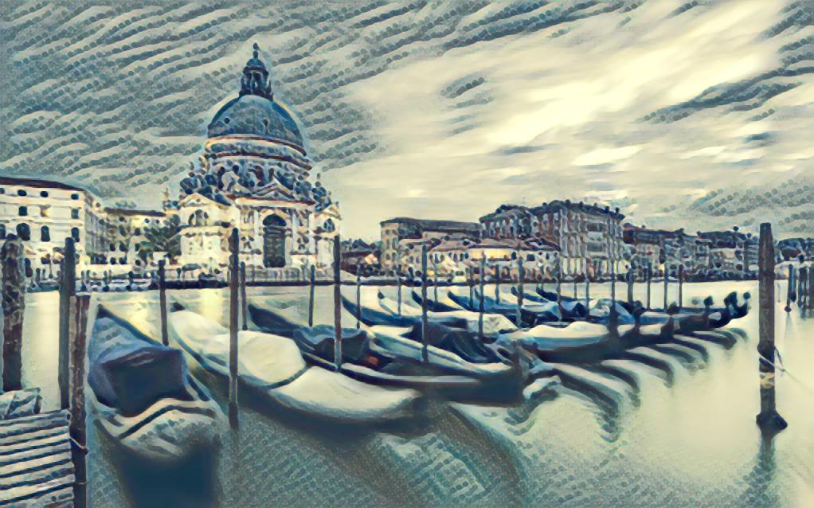

<table width="100%" border="0" cellspacing="15" cellpadding="0">
	<tbody>
		<tr>
			<td>
			<b>Multi-style Generative Network for Real-time Transfer</b>  [<a href="https://arxiv.org/pdf/1703.06953.pdf">arXiv</a>] [<a href="http://computervisionrutgers.github.io/MSG-Net/">project</a>]  <br>
  <a href="http://hangzh.com/">Hang Zhang</a>,  <a href="http://eceweb1.rutgers.edu/vision/dana.html">Kristin Dana</a>
<pre>
@article{zhang2017multistyle,
	title={Multi-style Generative Network for Real-time Transfer},
	author={Zhang, Hang and Dana, Kristin},
	journal={arXiv preprint arXiv:1703.06953},
	year={2017}
}
</pre>
			</td>
			<td width="440"><a></a></td>
		</tr>
	</tbody>
</table>

### Table of Contents
0. [Demo Video](#demo-video)
0. [Installation](#installation)
0. [Test and Demo](#test-and-demo)
0. [Train Your Own Model](#train-your-own-model)
0. [Release Timeline](#release-timeline)
0. [Acknowledgement](#acknowledgement)
0. [Example Results](Examples.md)

### Demo Video 
<a  href="http://www.youtube.com/watch?v=oy6pWNWBt4Y"></a>

### Installation
Please install [Torch7](http://torch.ch/) with cuda and cudnn support. The code has been tested on Ubuntu 16.04 with Titan X Pascal and Maxwell.
```bash
luarocks install https://raw.githubusercontent.com/zhanghang1989/MSG-Net/master/texture-scm-1.rockspec
```

### Test and Demo

0. Clone the repo and download pre-trained models
	```bash
	git clone git@github.com:zhanghang1989/MSG-Net.git
	cd MSG-Net/experiments
	bash models/download_models.sh 
	```
0. Web Camera Demo
	```
	qlua webcam.lua
	```
	
0. Test on Image
	```
	th test.lua -input_image images/content/venice-boat.jpg -image_size 1024
	eog stylized
	```









### Train Your Own Model
We are working on cleaning the training code, but we may decide to release it upon paper acceptance.

### Release Timeline
- [x] 03/20/2017 we have released the [demo video](https://www.youtube.com/watch?v=oy6pWNWBt4Y).
- [x] 03/24/2017 We have released [ArXiv paper](https://arxiv.org/pdf/1703.06953.pdf) and demo code with pre-trained models.
- [x] 03/30/2017 We have released the camera demo software.
- [ ] We are working on cleaning the training code, but we may decide to release it upon paper acceptance.

### Acknowledgement
The code benefits from outstanding prior work and their implementations including:
- [Texture Networks: Feed-forward Synthesis of Textures and Stylized Images](https://arxiv.org/pdf/1603.03417.pdf) by Ulyanov *et al. ICML 2016*. ([code](https://github.com/DmitryUlyanov/texture_nets))
- [Perceptual Losses for Real-Time Style Transfer and Super-Resolution](https://arxiv.org/pdf/1603.08155.pdf) by Johnson *et al. ECCV 2016* ([code](https://github.com/jcjohnson/fast-neural-style))
- [Image Style Transfer Using Convolutional Neural Networks](http://www.cv-foundation.org/openaccess/content_cvpr_2016/papers/Gatys_Image_Style_Transfer_CVPR_2016_paper.pdf) by Gatys *et al. CVPR 2016* and its torch implementation [code](https://github.com/jcjohnson/neural-style) by Johnson.
