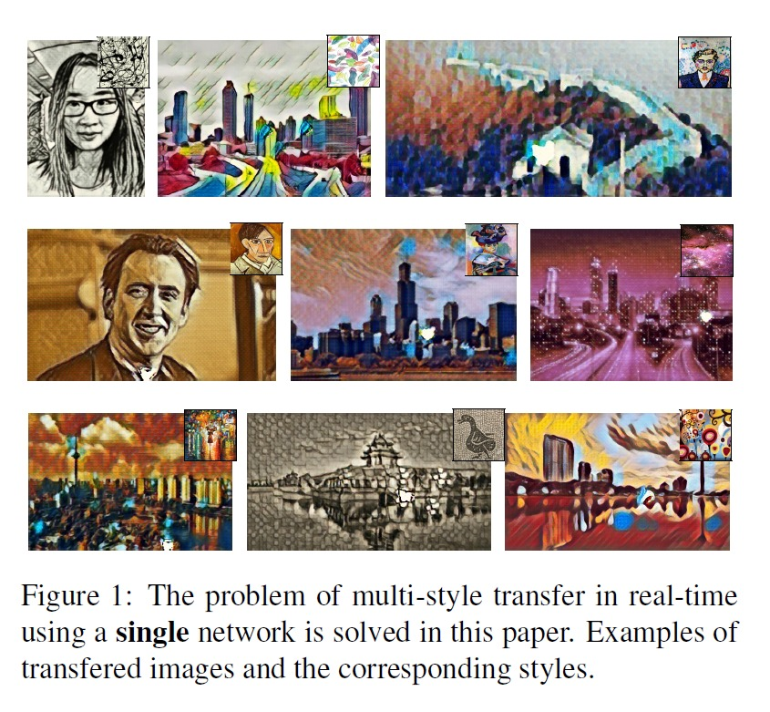

# Multi-style Generative Network (MSG-Net)

**Multi-style Generative Network for Real-time Transfer**  
  [Hang Zhang](http://hangzh.com/),  [Kristin Dana](http://eceweb1.rutgers.edu/vision/dana.html)

	

### Expected Timeline
- 03/24/2017 release demo video 
- 03/31/2017 release ArXiv paper and demo code with pre-trained models
